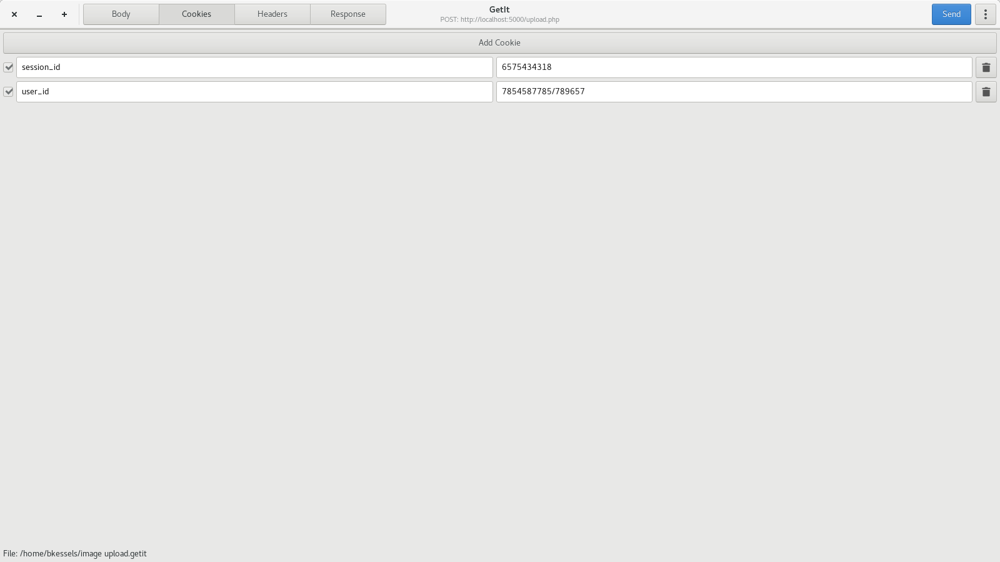

# GetIt

Application to send HTTP requests to test your API endpoints.

## Screenshots





## What can I do with it?

You can send numerous requests to a webserver. If you need it there is an
option for authentication, right now only basic auth and digest auth.

## Required packages

### Building
- gcc
- autoconf
- gtk3-devel
- gtksourceview3-devl
- json-glib-devel
- glib-devel
- libsoup-devel
- libnotify-devel

### Installing
- gtk3
- gtksourceview3
- json-glib
- glib
- libsoup
- libnotify

## Features

- Add multiple form-data elements to the body
- Add custom data to the body
- Add files to a request
- Add cookies to a request
- Add multiple headers
- Response data is displayed with syntax highlighting
- All headers from the response are shown
- Save a request
- Open a request

[GetIt features playlist](https://www.youtube.com/playlist?list=PLP-QZD6Cd0MWh7969cLZg31gO71s44Bk4)

## How to build

```
$ autoreconf --install
$ ./configure
$ make install
```
And then run `getit`

## Generate RPM package

You first need to download the latest release of GetIt using spectool.

```
$ cd packaging/RPM
$ spectool -g getit.spec
$ fedpkg --release f26 local
```

This will create a RPM file which can install using your package manager.

## COPR

If you have Fedora and don't want to build GetIt from source you can easily install it using dnf copr.

```
$ dnf copr enable bartkessels/getit
$ dnf install getit
```
