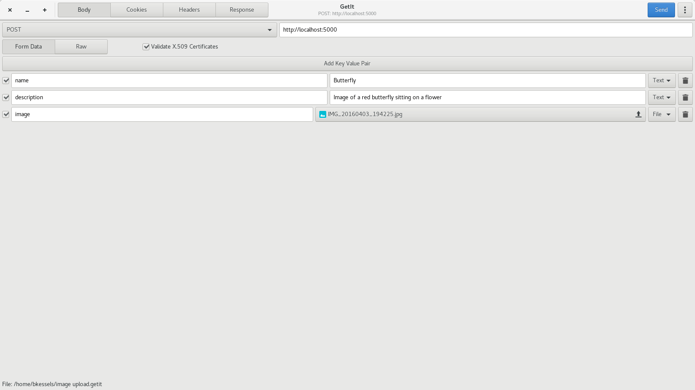

# GetIt

Application to send HTTP requests to test API's.

## Screenshots




## What can I do with it?

You can send numerous requests to a webserver. If you need it there is an
option for authentication, right now only basic auth and digest auth.

## Required packages

### Building
- gtk3-devel
- python3-devel
- automake
- gettext
- intltool
- itstool
- desktop-file-utils
- libnotify-devel

### Installing
- gtk3
- pygobject3
- python3-requests
- python3-jsonpickle
- libnotify

## Features

- Add multiple form-data elements to the body
- Add custom data to the body
- Add files to a request
- Add cookies to a request
- Add multiple headers
- Use basic auth or digest auth
- Response data is displayed with syntax highlighting
- All headers from the response are shown

## How to build
```
sudo mkdir -p /usr/share/getit/ui
sudo cp -r data/ui/* /usr/share/getit/ui

bash autogen.sh
./configure
sudo make install
```
And then run `./bin/getit`

If you don't copy the .ui files the application will crash because
it can't find the .ui files file.

## Generate RPM package
You first need to download the latest
release of GetIt using spectool.

```
spectool -g getit.spec
fedpkg --release f25 local
```

This will create a RPM file which you can install using your package manager.

## COPR

If you have Fedora and don't want to build GetIt from source you can easily install it using dnf copr.

```
sudo dnf copr enable bartkessels/GetIt
sudo dnf install getit
```
