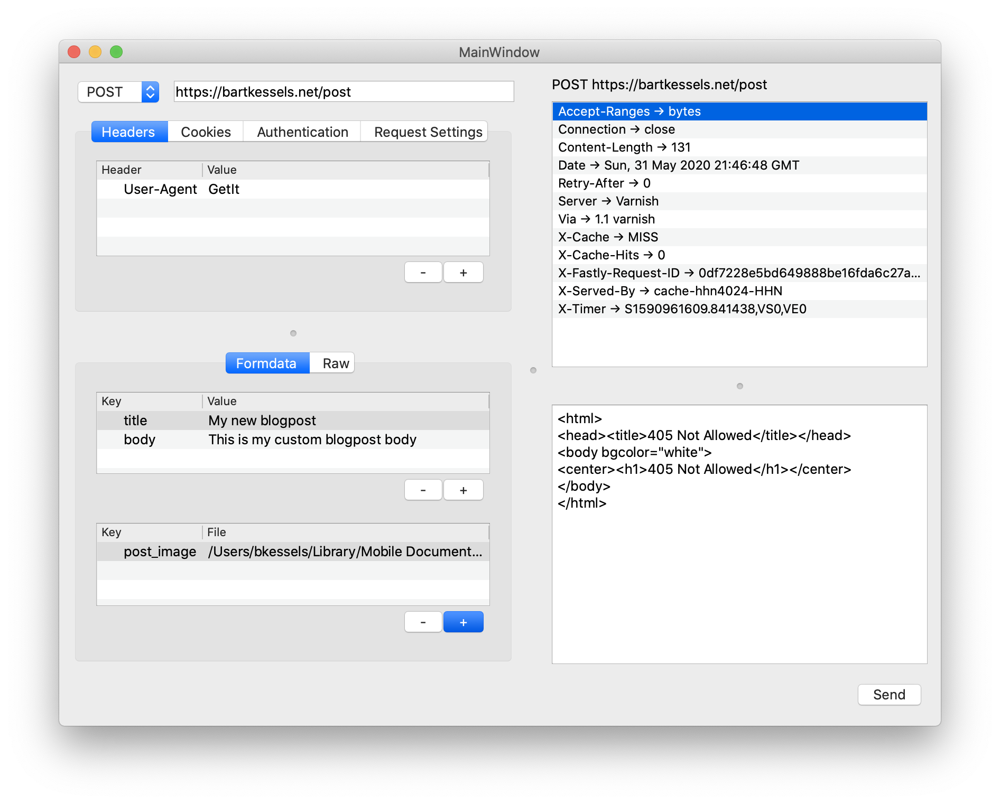

# GetIt

[](LICENSE)
[](https://travis-ci.org/bartkessels/getit)
[](https://www.codacy.com/manual/bartkessels/getit?utm_source=github.com&amp;utm_medium=referral&amp;utm_content=bartkessels/getit&amp;utm_campaign=Badge_Grade)

Application to send HTTP requests to test your API endpoints.

## Table of contents

- [1. Screenshots](#1-screenshots)
- [2. Features](#2-features)
- [3. Roadmap](#3-roadmap)
- [4. Required packages](#4-required-packages)
- [5. Build](#5-build)
    - [5.1 Tests](#51-tests)
    - [5.2 Application](#52-application)
    
## 1. Screenshots



## 2. Features

You can send numerous requests to a webserver. You can send RAW post data,
form post data, add cookies to your request and add headers to your request.

The goal of GetIt is making testing API's easier using open sources tools. If you're
missing a feature please do not hesitate to open a pull-request or create an issue.

## 3. Roadmap

Unfortunately there are only so many things we can implement in a specific time period, so there will be some
features that aren't included in GetIt but that we will add in the future.

- Add API for adding settings to the request API
- Syntax highlighting for the response
- Authentication
    - Basic auth
    - Oauth 1/2
- Custom time-out
- Saving / opening a request
    - The response will be saved as well for offline usage
- Reduce MainWindow class by refactoring multiple methods to other Widgets

There are some things we want get up and running to make life easier for the developers of GetIt, mostly for
distributing the application.

- Setup an automated CD pipeline
- Setup CI for Windows machine
- Setup Travis to generate test-coverage report
- Setup GUI test framework

## 4. Required packages

GetIt relies on a couple of external packages, some are being fetched using Cmake's `FetchContent` while others
are expected to be installed on your system.

The packages that are fetched by Cmake are [CppRestRequest](https://github.com/microsoft/cpprestsdk), a library from
[Microsoft](https://microsoft.com) to send HTTP requests using an easy C++ interface. This package is both used for
building the `getit` executable as well as the `getit_tests` executable. For the `getit_tests` executable the
[Catch2](https://github.com/catchorg/catch2) library is fetched as the unit-tests framework used by GetIt.

The packages you need to install

- `Qt5`, this is used for the GUI of Getit
- `Boost`, these libraries are used within [CppRestSdk](https://github.com/microsoft/cpprestsdk) library
- `CMake`, this is the build system used by GetIt

## 5. Build

Once you've installed the required packages you're ready to compile GetIt or the GetIt tests.

### 5.1 Tests

```bash
$ cd build
$ cmake ..
$ make getit_tests
$ ./bin/getit_tests
```

### 5.2 Application

```bash
$ cd build
$ cmake ..
$ make getit
$ ./bin/getit
```
